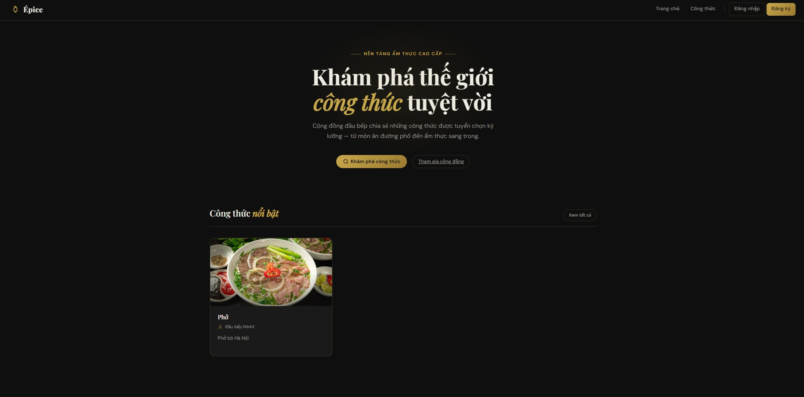

# Recipe Share — Cooking Recipe Sharing Platform

A social networking application for sharing cooking recipes: users post recipes → Admin reviews → Publicly displayed.

## User Interface Previews

### 1. Home Screen


### 2. Movie Detail Screen


### 3. Playback / Watching Screen


### 4. Movie Loading Screen


## Architecture (Conceptual)
Frontend (Recipe app): Web interface with a yellow, kitchen-themed design.

- **JWT** : Authentication between client and backend.
- **Public Access** : View recipes without requiring a login.
- **Recipes Service** : Manages recipes, uploads, and approval processes.
- **Chef Service** : Manages users (Chefs) and roles.
- **Image Processing Service** : Handles image processing (resizing, storage).
- **Database** : H2 (storing Chefs and Recipes).

## Roles & Permissions

| Role   | Description |
|-----------|--------|
| **Viewer** | Can only view approved recipes. |
| **User**   | Can post recipes (pending admin approval) and view their own recipes. |
| **Admin**  | Approves/rejects recipes and performs system administration. |

## Technologies

- **Backend**: Java 17, Spring Boot 3.2, Spring Security, JWT, JPA/H2, Thymeleaf.
- **Frontend**: HTML/CSS ( yellow kitchen theme ), Thymeleaf.

## Running the Application

```bash
mvn spring-boot:run
```

Access via: **http://localhost:8080**

### Default Account (Auto-generated on first run)

- **Admin**: `admin` / `admin123`

### Registration

- Go to Register → Select role Viewer or User. Once registered, a User can begin posting recipes.

## Main Directory Structure

```
src/main/java/com/recipeshare/
  config/          # Security, WebMvc, DataLoader
  entity/          # Chef, Recipe, Role, RecipeStatus
  repository/      # ChefRepository, RecipeRepository
  service/         # ChefService, RecipeService, ImageProcessingService
  controller/      # Home, Auth, Recipe, Admin
  security/        # JWT, UserDetails
  dto/
src/main/resources/
  templates/       # Thymeleaf (index, login, register, recipes/*, admin/*)
  static/css/      # style.css (theme vàng, nhà bếp)
  application.yml
```

## Main Workflow

1. **Viewer** : Visits Home / Recipes → Views the list and details of Approved recipes.

2. **User** : Logs in → Posts a recipe (cover image, ingredients, steps) → Recipe stays in Pending status within "My Recipes."

3. **Admin** : Logs in → Accesses Admin Dashboard → Approves or Rejects recipes. Approved recipes are then publicly displayed on the homepage and the Recipes gallery.
